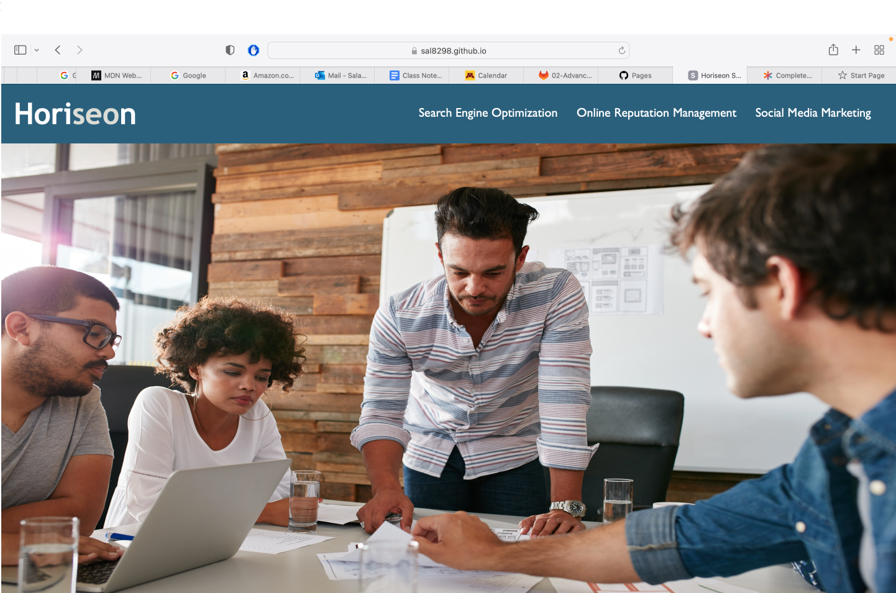
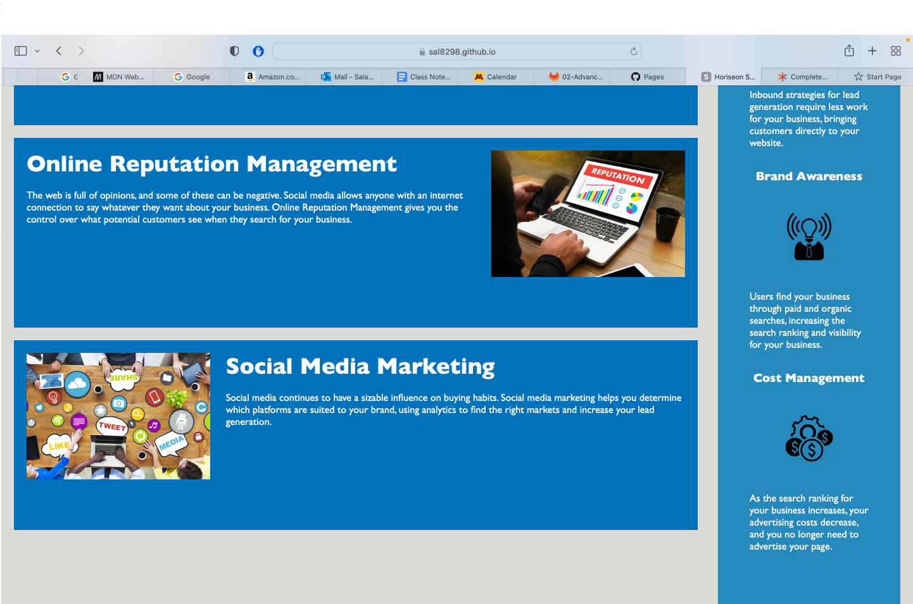

# Bootcamp-Challenge-1-Sal
Horiseon webpage with add tags for accessibility.

<Horiseon Challenge 1>

## Description

- Clients asked us to make the webpage more accessible. I started the project to be able to improve my skills in html and css. I optimized the html file by using better semantic tags for the elements. I reduced the number of classes with a more efficent design for both html and css files. I learnt about many different types of element and attribute tags in html and css.

## Table of Contents (Optional)

If your README is long, add a table of contents to make it easy for users to find what they need.

- [Installation](#installation)
- [Usage](#usage)
- [Credits](#credits)
- [License](#license)

## Installation

- Horiseon Social Solution Services can be accessed at https://sal8298.github.io/Bootcamp-Challenge-1-Sal/

## Usage

Provide instructions and examples for use. Include screenshots as needed.

## Credits

- Collaborators:
- Salahuddin Imdad (https://github.com/Sal8298)
- Miguel Montenegro (https://github.com/Darkunitx)
- Nicholas Mamberger (https://github.com/NickHM05)
- Garrett Winter (https://github.com/garrettWinter)

## License

The last section of a high-quality README file is the license. This lets other developers know what they can and cannot do with your project. If you need help choosing a license, refer to [https://choosealicense.com/](https://choosealicense.com/).

---

🏆 The previous sections are the bare minimum, and your project will ultimately determine the content of this document. You might also want to consider adding the following sections.

## Badges

Badges aren't necessary, per se, but they demonstrate street cred. Badges let other developers know that you know what you're doing. Check out the badges hosted by [shields.io](https://shields.io/). You may not understand what they all represent now, but you will in time.

## Features

If your project has a lot of features, list them here.

## How to Contribute

If you created an application or package and would like other developers to contribute it, you can include guidelines for how to do so. The [Contributor Covenant](https://www.contributor-covenant.org/) is an industry standard, but you can always write your own if you'd prefer.

## Tests

Go the extra mile and write tests for your application. Then provide examples on how to run them here.
